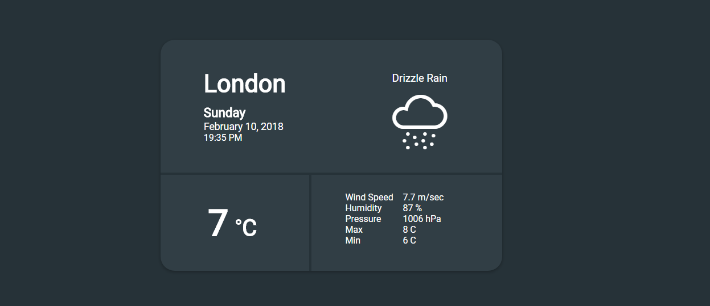
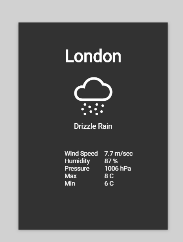

==LocalWeather 

[LocalWeather](https://localy-weather.surge.sh/) is the simple React application, showing you weather based on your current geolication position.
Mobile version too.



#### Commands
```javascript
yarn install            // install all dependencies
yarn server             // start webpack-dev server with hot-module-replacement enable
yarn format             // prettify all .js and .jsx files 
yarn test               // run jest tests
yarn test:coverage      // coverage tests
yarn lint               // eslint check
```

#### Building

```javascript
yarn build              // build ready to production version
```

Building use preact-compat package, for smaller bundle size.
### License

This project is issued under the [MIT license](./LICENSE).